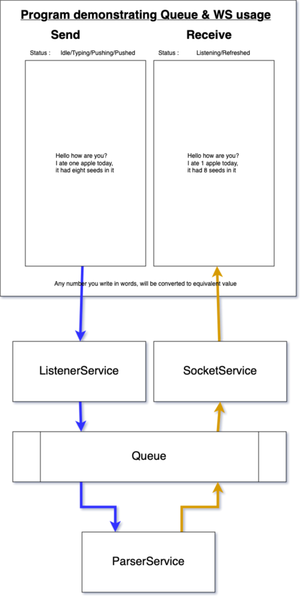

# Requirement
I want to create an angular app which will have just two pages - home & about
in the home page, I want to have two big vertical text boxes sitting next to each other. The left one will be editable and will accept user input, whereas right side will be just readonly
There should be a title above left text box saying "Send" and above right text box it should be "Receive".
There will be a subtitle "Status" below both textbox's title.
For Send text box, the possible value can be 
1. Idle - when user is not doing anything
2. Typing - when user is typing something
3. Pushing - when user stops typing, and we send the textbox content to backend via post request
4. Pushed - when the post request is complete.
For Receive text box, the possible status value can be
1. Listening - when it is just waiting for a message in websocket
2. Refreshed - when it got message in websocket, and same is rendered in the corresponding text box

The backend will be a .net application which will have three services and a Kafka queue
1. ListenerService - will be responsible for exposing API so that "Send" text box can send user input. After that, this service will push message to Queue on topic "userInputData"
2. ParserService - will be responsible for reading data from queue on "userInputData" topic. After that, it should replace all "x" in text with "y". Then it should push updated message to queue on topic "parsedData"
3. SocketService - will be responsible for maintaining a websocket with "Receive" text box. Once it get a message on queue in topic "parsedData", it should push that message to websocket.

# HLD
